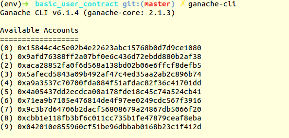
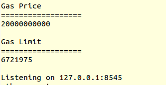

#User Contract

**Basic etherium contract for storing user using python and flask**

**How to Setup Project**

1-Create virtual env

2-Install Ganache is a personal blockchain for Ethereum development you can use to deploy contracts, develop your applications, and run tests.

`npm install -g ganache-cli`

3-Install python web3.
` pip3 install web3`

4-Install Flask 

`pip3 install flask`

5-Install Flask Rest

`pip3 install flask-restful`

6-Install Flask marshmallow is an object serialization/deserialization library

`pip3 install flask-marshmallow`

7-Start Ethereum Test blockchain server.

`ganache-cli`

Ganache gives us 10 default test accounts with 100 fake ethers in each account for transaction. We will use these accounts for deploying and setting values in contracts.

We can see the gas prize and limit along with host:port on which ganache is deployed. We will need this while deploying contract.